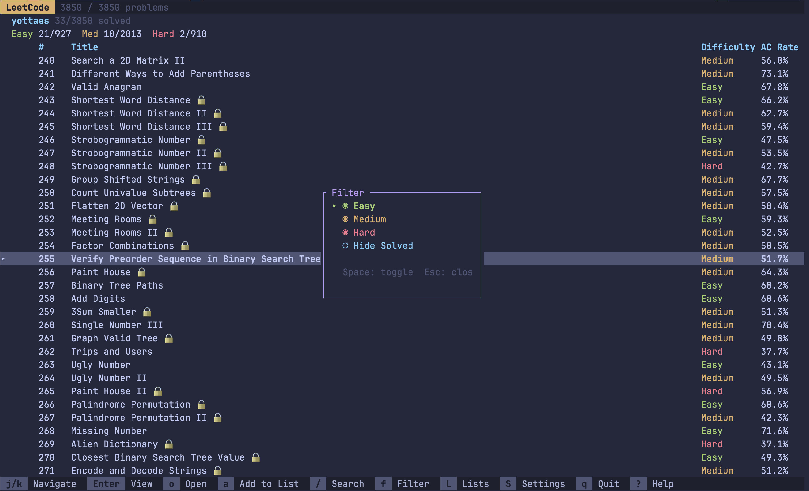
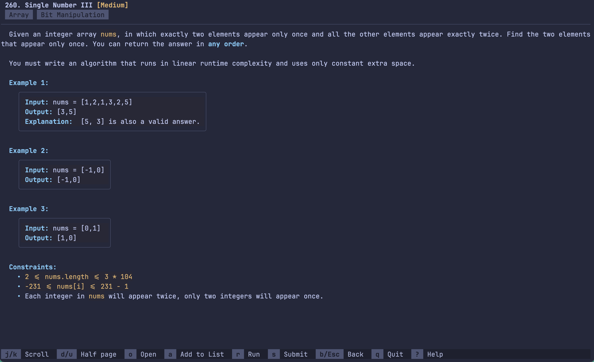

# leetui

A terminal-based interface for browsing, solving, and submitting LeetCode problems, built with **Rust** and **Ratatui**.

> This is a hobby project. I'm currently focusing on **Rust** only. If you want to contribute, feel free to submit a PR or fork the repo.

[](LICENSE)
[](https://crates.io/crates/leetui)

## Features

- **Browse** all 3000+ problems with instant search and difficulty/status filters
- **Read** problem descriptions rendered directly in the terminal
- **Scaffold** a Rust project with boilerplate for any problem, then open it in your editor
- **Run & Submit** code against LeetCode test cases without leaving the terminal
- **Personal Lists** synced with LeetCode -- browse, create, delete, and add problems
- **Stats** -- your solve counts right in the home screen
- **Disk cache** for instant startup with background refresh
- Press `?` on any screen for all available keybindings

## Installation

### From crates.io

```bash
cargo install leetui
```

### From source

```bash
git clone https://github.com/yottaes/leetui.git
cd leetui
cargo install --path .
```

### Shell wrapper (recommended)

When you scaffold a problem with `o`, the CLI opens your editor inside the problem directory. To auto-cd into that directory after exiting, add this to your `~/.zshrc` or `~/.bashrc`:

```bash
lc() {
  local dir
  dir=$(leetui "$@")
  if [ -n "$dir" ] && [ -d "$dir" ]; then
    cd "$dir"
  fi
}
```

Then use `lc` instead of `leetui`. This is needed because a child process can't change its parent shell's working directory -- the wrapper captures the path printed to stdout and cd's into it.

Without the wrapper everything works the same, you just won't auto-cd after exiting.

## Authentication

The CLI reads your LeetCode session cookies directly from your browser (via the [rookie](https://crates.io/crates/rookie) crate). No manual token pasting needed.

On first launch you'll be prompted to log in. The app will attempt to extract cookies automatically. If that fails, it will open `leetcode.com/accounts/login` in your browser -- log in there, then press Enter to retry.

**macOS note:** Your OS may show a Keychain access prompt. Grant access so the app can read browser cookies.

## Controls

Press `?` on any screen for the full keybinding reference. Here are the essentials:

### Home

| Key | Action |
|:----------|:-------------------------------|
| `j` / `k` | Navigate |
| `Enter` | View problem |
| `/` | Search |
| `f` | Filter by difficulty / status |
| `o` | Scaffold & open in editor |
| `a` | Add to list |
| `L` | Browse personal lists |
| `S` | Settings |
| `q` | Quit |

### Problem Detail

| Key | Action |
|:----------|:-------------------------------|
| `j` / `k` | Scroll |
| `d` / `u` | Half page down / up |
| `o` | Scaffold & open in editor |
| `r` | Run code (sample cases) |
| `s` | Submit solution (all cases) |
| `a` | Add to list |
| `b` / `Esc`| Back |

### Lists

| Key | Action |
|:----------|:-------------------------------|
| `Enter` | Open list / View problem |
| `n` | Create new list |
| `d` | Delete list / Remove problem |
| `Esc` | Back |

## Configuration

Settings are stored in `~/.leetcode-cli/config.toml`. You can edit them from within the app by pressing `S`, or edit the file directly:

- **workspace_dir** -- where scaffolded projects are created (default: `~/leetcode`)
- **language** -- `rust`, `python3`, `cpp`, `java`, `javascript`, `typescript`, `golang`
- **editor** -- command to open files (default: `nvim`)

## Contributing

This is a hobby project and I'm prioritizing Rust-specific features. That said:

- Feel free to **fork** the repo and do whatever you want with it
- PRs are welcome -- submit directly, no need to open an issue first

## License

[MIT](LICENSE)
